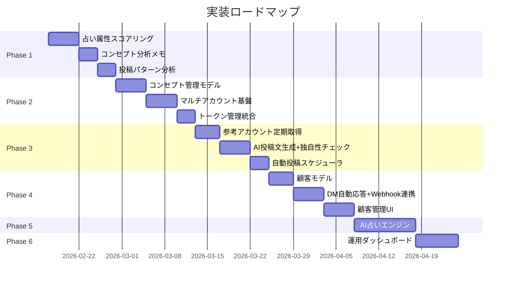

# 占いコンテンツマネタイズシステム — 全体実装計画

## 概要

プロジェクトの最終目的（Threads/Instagram上で占いコンテンツを提供し収益化する）を達成するために、現在のバズリサーチ基盤を土台として、**6つのフェーズ**に分けて段階的に機能を実装する。

---

## User Review Required

> [!IMPORTANT]
> **AI API の選択**: AI鑑定文生成・投稿文生成で使用するLLM APIを確認させてください。Claude API / OpenAI API / その他、どれを使用しますか？また、APIキーは既にお持ちですか？

> [!WARNING]
> **Meta API の制約**: Instagram Graph API / Threads API は、DM送信やコンテンツ公開に対してレート制限とレビュープロセスがあります。特にInstagram DM APIは「Instagram Messaging API」として別途Metaのレビューが必要です。現在のOAuth実装でどのスコープが承認済みか確認が必要です。

> [!CAUTION]
> **スクレイピングリスク**: 参考アカウントの定期スクレイピングは、Threads/Instagram の利用規約に抵触する可能性があります。頻度とボリュームを抑え、Playwright セッションの管理を慎重に行う必要があります。

---

## 現状のスコアリングに対する批判的検証

### 現行の問題点

現在の `growth_score` と `quality_score` は**汎用的な成長指標**であり、**占いビジネスのコンセプト設計には不十分**です。

| 指標 | 現在の計算 | 問題点 |
|---|---|---|
| 成長スコア | フォロワー密度 × エンゲージ品質 × 信頼度 | **ジャンルを無視している**。ITコンサルや主婦インフルエンサーも高スコアになる |
| 品質スコア | エンゲージ品質40% + 直近活動度25% + 投稿頻度20% + 信頼度15% | **投稿内容の質（テーマ適合性）を見ていない** |
| コンセプト候補判定 | 7-90日 + 500F + 10F/日 + スコア算出済み | **形式的な数値条件のみ**で、占い/スピ系かどうかを判定していない |
| 優良アカウント | 品質スコア50点以上 | 品質スコアに同じ問題を引きずっている |

### 改善案: 「占いリサーチ適合スコア」を追加

```
占いリサーチ適合スコア = 
    ジャンル適合度(40%) + 成長力(25%) + エンゲージ品質(20%) + マネタイズ度(15%)
```

| サブスコア | 計算方法 |
|---|---|
| ジャンル適合度 | bio + 投稿テキストに占い/スピ関連キーワードが含まれる割合。高頻度 = 専門アカウント |
| 成長力 | 既存の growth_score を正規化 |
| エンゲージ品質 | 既存の quality_score からサブスコアを流用 |
| マネタイズ度 | bio/投稿に「鑑定」「STORES」「LINE」「有料」等マネタイズ導線ワードがあるか |

### 占い属性の自動判定

bio と投稿テキストからキーワードマッチングで自動分類：

```python
FORTUNE_KEYWORDS = [
    '占い', '鑑定', 'タロット', '星座', '運勢', '開運', 'スピリチュアル',
    '風水', '数秘', '四柱推命', 'パワーストーン', '手相', '霊感', '透視',
    'ヒーリング', 'チャネリング', 'オーラ', 'エンジェル', 'カード',
    '満月', '新月', '月星座', '宿曜', '九星', '算命学', 'ルノルマン',
    '西洋占星術', 'アストロ', 'ホロスコープ', '12星座',
]
NON_FORTUNE_KEYWORDS = [
    'プログラミング', 'エンジニア', 'コンサル', 'マーケティング',
    'ダイエット', '筋トレ', '料理', 'レシピ', '転職', 'FX', '株取引',
]
```

- **自動「対象外」**: bio に占い関連キーワードが0件 & 非占いキーワードが2件以上 → `is_excluded = True`
- **自動「コンセプト候補」**: 従来の数値条件 + ジャンル適合度30点以上

---

## Phase 1: リサーチ機能強化 + スコアリング改善（1-2週間）

### 目的
現在のリサーチ基盤を「占いアカウント発見ツール」として本質的に有効なものにする。

---

### 1-A. 占い属性スコアリング

#### [MODIFY] models.py

`THBuzzAuthor` に以下のフィールドを追加：

```python
# ─── 占いリサーチ適合指標 ───
fortune_relevance_score = FloatField('占い適合スコア', null=True, blank=True)
genre_tags = JSONField('ジャンルタグ', default=list, blank=True,
    help_text='自動検出: ["占い","タロット","スピリチュアル"...]')
monetization_signals = JSONField('マネタイズシグナル', default=list, blank=True,
    help_text='検出: ["STORES","LINE","有料鑑定"...]')
auto_excluded_reason = CharField('自動対象外理由', max_length=200, blank=True, default='')
```

#### [NEW] fortune_classifier.py

占い属性判定サービス：
- bio + 全投稿テキストからキーワードマッチング
- ジャンル適合度・マネタイズ度・占いリサーチ適合スコアを算出
- 非占いアカウントの自動対象外設定

#### [MODIFY] buzz.py

- ランキング画面に「占い適合スコア」ソート・フィルタを追加
- 投稿者詳細画面にジャンルタグ・マネタイズシグナルを表示

---

### 1-B. コンセプト分析メモ機能

#### [MODIFY] buzz_author_detail.html

投稿者詳細画面に：
- メモ編集フォーム（`THBuzzAuthor.memo`フィールドは既存）
- 「伸びている要因」を構造化して入力できるUI（3項目以上のチェックリスト形式）
- メモ付きアカウントの一覧表示フィルタ

#### [MODIFY] buzz.py

- メモ保存API追加
- メモ付きフィルタ追加

---

### 1-C. 投稿パターン分析

#### [MODIFY] buzz_author_detail.html

投稿者の詳細画面に：
- 投稿時間帯分布（ヒートマップ: 曜日 × 時間）
- メディア種別（テキスト/画像/動画/カルーセル）の比率
- バズ投稿のテキスト長・キーワード頻度
- 投稿頻度の推移グラフ

---

## Phase 2: マルチアカウント管理基盤（2-3週間）

### 目的
Threads / Instagram 両方で複数アカウントを運用するための基盤を構築する。

---

### 2-A. コンセプト管理モデル

#### [NEW] concept/models.py

新Djangoアプリ `concept` を作成：

```python
class AccountConcept(models.Model):
    """アカウントのコンセプト定義"""
    name = CharField('コンセプト名', max_length=100)
    character_name = CharField('キャラクター名', max_length=100)
    title = CharField('肩書き', max_length=200)
    target_audience = TextField('ターゲット層')
    fortune_type = CharField('占術', max_length=200)
    writing_style = TextField('文体設定')
    bio_template = TextField('bio テンプレート')
    icon_description = TextField('アイコンの特徴')
    price_range = CharField('価格帯', max_length=100)
    differentiator = TextField('差別化ポイント')
    
    reference_authors = ManyToManyField('th.THBuzzAuthor', blank=True)
    reference_notes = TextField('参考アカウント分析メモ', blank=True)
    
    system_prompt = TextField('AI生成用システムプロンプト', blank=True)
    fortune_prompt_template = TextField('占いコンテンツ生成プロンプト', blank=True)
    post_prompt_template = TextField('投稿文生成プロンプト', blank=True)
    
    is_active = BooleanField('アクティブ', default=True)
    created_at = DateTimeField(auto_now_add=True)
    updated_at = DateTimeField(auto_now=True)


class ManagedAccount(models.Model):
    """運用アカウント（TH/IG 統合管理）"""
    PLATFORM_CHOICES = [('threads', 'Threads'), ('instagram', 'Instagram')]
    
    concept = ForeignKey(AccountConcept, on_delete=models.CASCADE, related_name='accounts')
    platform = CharField('プラットフォーム', max_length=20, choices=PLATFORM_CHOICES)
    username = CharField('ユーザー名', max_length=100)
    external_id = CharField('外部ID', max_length=100)
    access_token = TextField('アクセストークン', blank=True)
    token_expires_at = DateTimeField(null=True, blank=True)
    
    auto_post_enabled = BooleanField('自動投稿有効', default=False)
    post_frequency_per_day = IntegerField('1日の目標投稿数', default=3)
    post_time_slots = JSONField('投稿時間スロット', default=list,
        help_text='例: ["08:00","12:30","19:00"]')
    
    auto_reply_enabled = BooleanField('自動応答有効', default=False)
    initial_reply_template = TextField('初回自動応答テンプレート', blank=True)
    
    is_active = BooleanField('アクティブ', default=True)
    created_at = DateTimeField(auto_now_add=True)
```

---

### 2-B. トークン管理の統合

- 環境変数ベースの単一アカウント設定から、DB管理の複数アカウント設定に移行
- 長期トークンの自動更新（Meta API の60日制限対応）
- Management command: `refresh_tokens`

---

## Phase 3: コンテンツ自動パイプライン（3-4週間）

### 目的
参考アカウントの投稿を定期的に取得 → AIで自分のコンセプトに書き換え → 独自性チェック → 自動投稿。

---

### 3-A. 参考アカウント定期スクレイピング

- `AccountConcept.reference_authors` に紐づく参考アカウントの新規投稿を定期取得
- 差分取得（前回取得以降の新規投稿のみ）
- cron/scheduler から定期実行（1日1-2回）

### 3-B. AI投稿文生成 + 独自性チェック

```python
class ContentGenerator:
    def generate_post(self, concept, reference_post):
        """参考投稿をコンセプトに沿った独自の投稿に書き換え"""
        
    def check_originality(self, generated_text, reference_text):
        """独自性チェック: 類似度が高すぎたらリジェクト"""
        
    def generate_fortune_post(self, concept, theme):
        """完全オリジナルの占い投稿を生成"""
```

### 3-C. 自動投稿スケジューラ統合

- `ContentDraft` が `approved` → `scheduled_at` の時刻に自動投稿
- 投稿先アカウントのプラットフォームに応じて TH/IG API を呼び分け

---

## Phase 4: 顧客管理 + DM自動応答（3-4週間）

### 目的
DMで接触してくるエンドユーザー（潜在顧客）を管理し、無料鑑定→有料転換のフローを実現する。

---

## Phase 5: AI占いコンテンツ生成エンジン（2-3週間）

### 目的
AI で占いコンテンツ（鑑定文）を生成する仕組みを構築する。

---

## Phase 6: 運用ダッシュボード + 追加提案（長期）

| 提案 | 概要 | 理由 |
|---|---|---|
| **投稿パフォーマンス追跡** | 自分の投稿のER・インプレッション・フォロワー増を自動追跡 | PDCA高速化 |
| **開運カレンダー連携** | 満月・新月・水星逆行等のイベントを自動検出し、投稿テーマを提案 | 占いアカウントは天文イベントとの連動が集客の定石 |
| **A/Bテスト機能** | 同一テーマで文体を変えた2パターンを生成し、反応を比較 | データドリブンで最適なコンセプトを検証 |
| **フォロワー増減アラート** | 自アカウントのフォロワーが急増/急減したら通知 | トレンドに乗れたか、炎上リスクかを早期検知 |
| **競合ウォッチリスト** | 特定の競合アカウントの投稿頻度・フォロワー推移を定期監視 | 市場環境の変化を把握 |

---

## 実装の優先順序



---

## 検証計画

### Phase 1 の検証

- **占い属性スコアリング**: 既存DBの `THBuzzAuthor` のうち、手動で対象外にしたアカウントのbio/投稿を分析し、自動判定の精度を検証
- **コンセプトメモ**: ブラウザでメモの保存・表示・フィルタを動作確認
- **投稿パターン分析**: 既知のバズアカウントの分析結果が妥当か目視確認

### Phase 2-6 の検証

各フェーズ完了時に：
1. **ユニットテスト**: モデルのバリデーション、サービス層のロジック
2. **ブラウザ動作確認**: 管理画面の操作フロー
3. **VPS デプロイ**: `git push` → VPSで `git pull` → `docker compose up` → 本番動作確認
